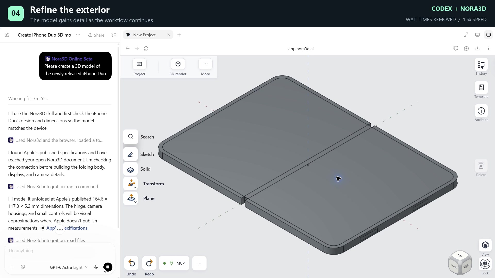

# Nora3D for Codex

**Your next part. Built with Codex.**

Create CAD from a prompt or drawing, with your Nora3D document right beside the conversation. Describe it. Build it. Keep editing.

[Watch the demo · 39 seconds](assets/iphone-duo-demo.mp4) — from a prompt to “fold it.” Edited recording; wait times removed and some steps sped up.

## Install

You need the **Codex desktop app** and a **Nora3D account**. No invitation or local CAD server required.

1. In Codex, go to **Plugins → Add → Add a marketplace**.
2. Enter the following, leaving **Sparse paths** empty:

   | Field | Value |
   | --- | --- |
   | Source | `https://github.com/Nora3d-creator/nora3d-codex-plugin` |
   | Git ref | `main` |

3. Install **Nora3D Online Beta** from **Nora3D Beta** and complete the Nora3D authorization. Keep Codex open until authentication finishes, then start a new task.

During private testing, your GitHub account needs access to this repository.

## Build your first part

Mention **@Nora3D Online Beta** and ask it to open [Nora3D](https://app.nora3d.ai) in the task’s built-in browser. Sign in, then open or create a part document. If disconnected, click **MCP** below the canvas; the assistant verifies that document before editing.

> In the current document, create an 80 × 50 × 6 mm plate with a centered 10 mm through-hole. Check the dimensions and save it.

Keep the document tab open and continue with follow-up requests. Replies follow your language.

## Updates

Use **Upgrade** on the Git marketplace, then install the updated plugin if the installed version is still older. Start a new task after updating. Current release: **0.2.0-beta.22**.

[Website](https://nora3d.ai/codex) · [Changelog](CHANGELOG.md) · [Support](mailto:nora3d.ai@gmail.com)
